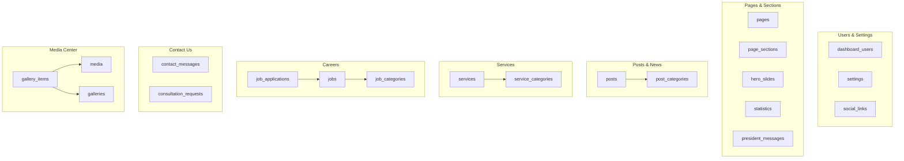

# CCESS CMS Project Explanation & Architecture Guide

This document explains the complete database schema, content architecture, coding patterns, and layout modularity for the CCESS CMS Dashboard.

---

## 1. Approved Database Schema Direction

The CMS database uses 20 tables to cover the CCESS website sections (Home, About Us, Services, Media Center, Careers, Contact Us, and Settings). The schema is structured as follows:



---

## 2. Detailed Module Architectures

### A. Posts & Media Center (Unified Content Table)
To prevent creating separate databases for news, articles, events, etc., the project implements a **unified table approach**:
*   **Table**: `posts`
*   **Supported Type Enums** (using `unsignedTinyInteger` + Bensampo Enums instead of native database enums):
    *   `news`, `article`, `report`, `research`, `event`, `media_appearance`, `media_intervention`, `economic_forum`, `spotlight`, `publication`
*   **Columns**:
    *   `title_ar` / `title_en` (localized title strings)
    *   `slug` (URL-friendly string)
    *   `short_description_ar` / `short_description_en`
    *   `content_ar` / `content_en`
    *   `image` (relative upload file path)
    *   `video_url` (optional embedded link)
    *   `type` (unsignedTinyInteger mapping to Bensampo type enums)
    *   `category_id` (foreign key to `post_categories`)
    *   `is_featured` / `is_published` (booleans)
    *   `published_at` (timestamp)
    *   `sort_order` (integer for sequencing)
    *   `seo_title` / `seo_description` (for SEO optimizations)

### B. Services Module
*   **Categories (`service_categories`)**:
    *   *الدراسات والبحوث الاقتصادية* (Economic Research & Studies)
    *   *الاستشارات المالية والاستثمارية* (Financial & Investment Consultations)
    *   *التطوير المؤسسي والاستراتيجي* (Institutional & Strategic Development)
*   **Services (`services`)**:
    *   Linked to a category via `category_id`.
    *   Contains fields: `title_ar`, `title_en`, `description_ar`, `description_en`, `image`, `icon` class, `sort_order`, and active state boolean `is_active`.

### C. Careers Module
*   **Categories (`job_categories`)**:
    *   *قسم التحليل* (Analysis Dept)
    *   *قسم الأبحاث* (Research Dept)
    *   *قسم الاستشارات* (Consultation Dept)
    *   *الحسابات* (Accounting)
    *   *أعمال إدارية* (Administrative Work)
*   **Job Posts (`jobs`)**: Linked to categories.
*   **Job Applications (`job_applications`)**:
    *   Stores submissions from candidate forms.
    *   Fields: `name`, `email`, `phone`, `address`, `current_job`, `cv_file` (stored inside secure storage directory), `message`, and target `job_id`.

### D. Contact & Consultation Requests
*   `contact_messages`: Handles message submissions from the general "Contact Us" page.
*   `consultation_requests`: Dedicated handler for repeated Call-to-Action (CTA) section: *"هل تحتاج إلى استشارة اقتصادية متخصصة؟"* (Do you need a specialized economic consultation?).

---

## 3. Coding Patterns & Best Practices

The project strictly follows the **Thin Controller + Service Layer** pattern to ensure clean, readable, and maintainable MVC code.

### A. Controllers (Thin Layer)
Controllers do not write database records or perform raw queries directly. Their role is restricted to:
1.  Receiving the HTTP request.
2.  Delegating input validation to custom **Form Requests** (e.g., `UpdateProfileRequest`).
3.  Invoking the corresponding **Service class** method.
4.  Returning redirects or Blade views.

### B. Service Classes (Business Logic Layer)
All business operations reside in `app/Services/Dashboard/`.
*   **ProfileService**: Separates details modification from password updates.
*   **LoginService**: Handles session-specific login guard checks.
*   **MediaUploadService**: A centralized uploader class. Instead of repeating file validation, renaming, and directory creation in 10 different controllers, this service exposes uniform methods to store assets in `public/uploads` and return relative paths.

### C. Form Requests (Validation Layer)
Incoming form inputs are filtered prior to executing controller actions.
*   E.g., `UpdatePasswordRequest` ensures that `current_password` validates against the logged-in user's hash, and that the new password meets length and confirmation parameters before the controller ever runs.

---

## 4. Blade Views & Modularity

The layout system inside `resources/views/dashboard/` is structured to avoid code duplication:
- **Header, Sidebar, Footer components** are segmented into individual partials. They are included once in `layouts/app.blade.php`.
- **Reusable UI Components**: Toggles, image upload previews, inputs, textareas, and alerts are isolated inside `components/ui/` and registered with the `dashboard` prefix. They can be invoked cleanly across any CRUD forms:
  ```html
  <x-dashboard::ui.input 
      type="text" 
      name="title_en" 
      label="Title (English)" 
      required 
  />
  ```
- **Modular Paths**: The dashboard Blade views are kept separated from the frontend web routes to prevent code leak or stylesheet conflicts.
